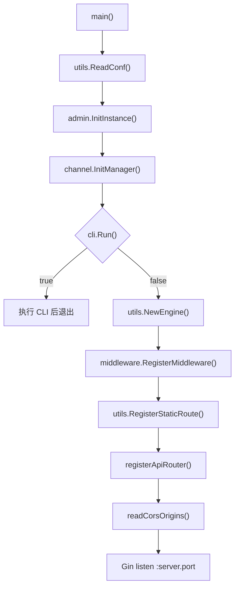
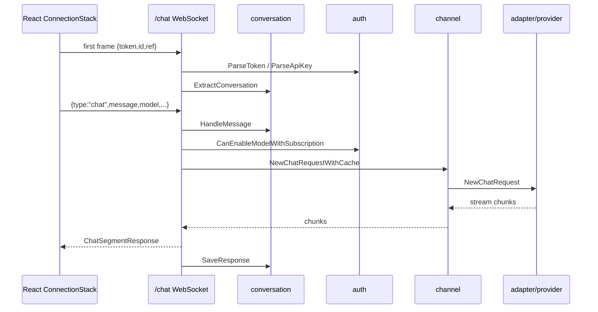

# CoAI.Dev 项目结构与功能分析

> 目的：为后续 Bug 修复和二开提供项目地图。本文基于当前仓库源码阅读整理，重点说明目录职责、启动流程、核心功能链路、前后端关系、数据存储和常见改动入口。

## 1. 项目定位

当前项目是 **CoAI.Dev / chatnio** 类型的一体化 AIGC 商业站点，核心能力包括：

- 多模型聊天与 WebSocket 流式响应。
- OpenAI 兼容 API 中转：`/v1/chat/completions`、`/v1/images/generations`、`/v1/models` 等。
- 多上游渠道管理：优先级、权重、重试、模型映射、用户分组、代理、密钥池。
- 后台管理：用户、渠道、计费规则、订阅、兑换码、邀请、日志、数据统计、模型市场、系统配置。
- 用户体系：登录、注册、邮箱验证码、Token、API Key、配额、订阅、钱包/购买入口。
- 会话体系：会话保存、重命名、删除、分享、预设/Mask。
- 扩展功能：文生图、Midjourney 回调、Web 搜索、文章/项目生成、卡片生成等。
- 前端体验：React + Redux + Vite + Tailwind/Radix，支持 PWA 和可选 Tauri 桌面端。

## 2. 技术栈

### 后端

- 语言/框架：Go 1.20 + Gin。
- 配置：Viper，默认读取 `config/config.yaml`，不存在时从 `config.example.yaml` 复制。
- 数据库：MySQL 为主；未配置 `mysql.host` 时降级使用 SQLite `./db/chatnio.db`。
- 缓存/限流：Redis。
- 通信：REST + WebSocket + SSE。
- 日志：Logrus + lumberjack。
- 主要三方能力：JWT、Gorilla WebSocket、tiktoken、邮件、文档处理、各模型供应商 SDK/请求封装。

### 前端

- React 18 + TypeScript + Vite。
- 状态管理：Redux Toolkit。
- UI：Radix UI、Tailwind CSS、Tremor、lucide-react、shadcn 风格组件。
- 内容渲染：Markdown、Mermaid、KaTeX、代码高亮。
- 国际化：i18next。
- 构建：`pnpm build`，产物在 `app/dist`，后端可直接托管。

## 3. 顶层目录职责

| 路径 | 职责 |
|---|---|
| `main.go` | 后端主入口：读取配置、初始化单例、注册中间件、静态资源和 API 路由。 |
| `adapter/` | 上游模型适配层，按供应商拆分：OpenAI、Azure、Claude、Gemini/PaLM、Midjourney、DashScope、Dify、Coze 等。 |
| `channel/` | 渠道配置、优先级/权重调度、计费规则、套餐计划、系统配置、附件服务。 |
| `manager/` | 聊天 WebSocket、OpenAI 兼容中转、图片/视频 Relay、用量查询、广播、会话管理。 |
| `auth/` | 用户登录注册、Token/API Key、配额、订阅、兑换码、邀请、支付入口。 |
| `admin/` | 后台管理 API：用户、渠道、计费、模型市场、统计、记录、日志、支付、兑换码等。 |
| `middleware/` | CORS、DB/Redis 注入、限流、鉴权和 Admin 权限拦截。 |
| `connection/` | MySQL/SQLite、Redis 初始化，建表与迁移。 |
| `utils/` | 配置保存、静态资源、WebSocket、SSE、缓存、文件、加密、Token 计算、SMTP 等工具。 |
| `globals/` | 全局常量、模型列表、计费类型、运行开关、接口类型和 SQL 兼容辅助。 |
| `addition/` | 附加功能：卡片、Web 搜索、文章生成、项目生成。README 中标注部分附加功能已停止支持。 |
| `cli/` | 命令行入口，如管理员、邀请、Token 等 CLI 操作。 |
| `app/` | 前端 React/Vite 项目。 |
| `Dockerfile` / `docker-compose*.yaml` | 容器构建与部署。 |
| `db/` / `redis/` / `logs/` / `storage/` | 本地运行数据目录或挂载目录。 |
| `chat` | 当前工作区已有的本机编译产物，不是源码。 |

## 4. 启动流程

后端主流程在 `main.go`：



关键细节：

- `utils.ReadConf()` 设置 `config/config.yaml`，启用环境变量覆盖，例如 `MYSQL_HOST` 覆盖 `mysql.host`。
- `secret` 长度小于 32 会警告并延迟 10 秒启动。
- `channel.InitManager()` 会初始化渠道、计费、系统配置和套餐计划单例。
- `middleware.RegisterMiddleware()` 会连接数据库和 Redis，并把它们写入 Gin Context。
- `serve_static=true` 时 API 挂在 `/api` 下，同时后端托管 `app/dist`。
- `serve_static=false` 时 API 直接注册在根路径，适合前后端分离部署。

## 5. 中间件与鉴权

中间件顺序：

1. `CORSMiddleware()`：处理跨域；`/v1`、`/dashboard`、`/mj` 默认开放跨域。
2. `BuiltinMiddleWare(db, cache)`：把 DB 和 Redis 注入请求上下文。
3. `ThrottleMiddleware()`：基于 Redis 对登录、注册、聊天、会话、后台统计等路径做限流。
4. `AuthMiddleware()`：解析 `Authorization`，设置 `auth/user/agent/admin` 上下文。

鉴权规则：

- `Authorization: Bearer sk-*` 走 API Key，`agent=api`。
- 其他 Bearer 值走 Web Token，`agent=token`。
- `/admin` 前缀强制 `admin=true`，否则 401。
- `/v1/chat/completions` 要求 API Key agent，普通 Web Token 不能调用 Relay。

## 6. 后端路由总览

### 用户与认证

注册位置：`auth/router.go`

| 路径 | 方法 | 功能 |
|---|---|---|
| `/login` | POST | 登录。 |
| `/register` | POST | 注册。 |
| `/verify` | POST | 邮箱验证码。 |
| `/reset` | POST | 重置密码。 |
| `/state` | POST | 当前登录状态。 |
| `/userinfo` | GET | 用户信息。 |
| `/apikey` | GET | 获取 API Key。 |
| `/resetkey` | POST | 重置 API Key。 |
| `/package` | GET | 用户包/权益。 |
| `/quota` | GET | 点数配额。 |
| `/subscription` | GET | 订阅状态。 |
| `/subscribe` | POST | 订阅操作。 |
| `/buy` | POST | 购买入口。 |
| `/invite` | GET | 邀请码兑换。 |
| `/redeem` | GET | 兑换码兑换。 |

### 聊天与 OpenAI 兼容中转

注册位置：`manager/router.go`

| 路径 | 方法 | 功能 |
|---|---|---|
| `/chat` | GET/WebSocket | 前端聊天主通道。 |
| `/v1/models` | GET | OpenAI 兼容模型列表。 |
| `/v1/market` | GET | 模型市场。 |
| `/v1/charge` | GET | 计费规则。 |
| `/v1/plans` | GET | 套餐计划。 |
| `/v1/chat/completions` | POST | OpenAI 兼容 Chat Completions。 |
| `/v1/images/generations` | POST | OpenAI 兼容图片生成。 |
| `/v1/videos` | POST | 视频任务。 |
| `/v1/videos/:id/content` | GET | 视频内容代理。 |
| `/dashboard/billing/usage` | GET | Billing usage。 |
| `/dashboard/billing/subscription` | GET | Billing subscription。 |

### 会话与分享

注册位置：`manager/conversation/router.go`

| 路径 | 方法 | 功能 |
|---|---|---|
| `/conversation/list` | GET | 会话列表。 |
| `/conversation/load` | GET | 加载会话。 |
| `/conversation/rename` | POST | 重命名。 |
| `/conversation/delete` | GET | 删除。 |
| `/conversation/clean` | GET | 清空。 |
| `/conversation/share` | POST | 创建分享。 |
| `/conversation/view` | GET | 查看分享。 |
| `/conversation/share/list` | GET | 分享列表。 |
| `/conversation/share/delete` | GET | 删除分享。 |
| `/conversation/mask/view` | GET | 读取 Mask。 |
| `/conversation/mask/save` | POST | 保存 Mask。 |
| `/conversation/mask/delete` | POST | 删除 Mask。 |

### 管理后台

注册位置：`admin/router.go` 与 `channel/router.go`

主要覆盖：

- `/admin/channel/*`：渠道增删改查、启用/停用。
- `/admin/charge/*`：计费规则查看、设置、同步、删除。
- `/admin/config/*`：系统配置查看/更新、搜索测试。
- `/admin/plan/*`：套餐计划配置。
- `/admin/user/*`：用户列表、点数、订阅、等级、密码、邮箱、禁用、管理员、Root 密码。
- `/admin/record/*`：请求记录和统计。
- `/admin/analytics/*`：模型、请求、计费、错误、用户分析。
- `/admin/payment/*`：支付记录与重查。
- `/admin/invitation/*`、`/admin/redeem/*`：邀请和兑换码。
- `/admin/market/update`：模型市场更新。
- `/admin/logger/*`：日志列表、下载、控制台、删除。
- `/admin/license`：License 信息。

### 附加与回调

- `/mj/notify`：Midjourney 回调。
- `/attachments/:hash`：附件服务。
- `/broadcast/*`：公告/广播。
- `/card`：卡片生成。
- `/generation/*`：项目生成。
- `/article/*`：文章生成。

## 7. 聊天请求链路

### 前端 WebSocket

前端入口：`app/src/api/connection.ts`

- WebSocket 地址：`${websocketEndpoint}/chat`。
- 首帧发送 `{ token, id }`，`id=-1` 表示新会话。
- 支持事件：`chat`、`stop`、`restart`、`mask`、`edit`、`remove`、`share`。
- `ConnectionStack` 最多保留 5 个连接，连接失败会自动重连。

### 后端 WebSocket

后端入口：`manager/manager.go` 的 `ChatAPI`：



关键文件：

- `manager/manager.go`：WebSocket 握手、消息事件分发。
- `manager/chat.go`：聊天主处理，配额校验、Web 搜索包装、模型调用、流式回包、扣费、保存回复。
- `manager/connection.go`：WebSocket 连接栈、停止信号、并发线程限制。
- `manager/conversation/*.go`：会话载入、保存、分享、Mask。
- `channel/worker.go`：带缓存的渠道调用。
- `adapter/*`：不同上游供应商的请求实现。

## 8. OpenAI 兼容 Relay 链路

入口：`manager/chat_completions.go`

Relay 只接受 API Key：

1. `AuthMiddleware` 解析 `sk-*` API Key。
2. `ChatRelayAPI` 校验 `agent=api`。
3. 解析 OpenAI 格式请求体。
4. `web-` 模型前缀会触发 Web 搜索包装。
5. `-official` 后缀会去掉 official 标记并调整响应 quota 字段。
6. 校验配额/订阅。
7. 流式请求返回 SSE chunk；非流式请求返回 OpenAI 兼容 JSON。
8. 请求结束后记录统计、扣配额；失败则回滚订阅用量。

相关文件：

- `manager/chat_completions.go`
- `manager/relay.go`
- `manager/images.go`
- `manager/videos.go`
- `auth/apikey.go`
- `channel/worker.go`

## 9. 渠道、模型与计费

入口：`channel/manager.go`

渠道配置来自 Viper 的 `channel` key，结构在 `channel/types.go`：

- `type`：渠道类型，如 `openai`、`azure`、`claude`、`midjourney`、`qwen`、`dify`。
- `priority`：优先级，数值越大越先用。
- `weight`：同优先级下的随机权重。
- `models`：渠道支持模型。
- `mapper`：模型映射，格式为 `from>to`，支持 `!from>to` 排除真实模型。
- `retry`：单渠道重试次数。
- `secret`：密钥，可按行配置多个，调用时随机选择。
- `group`：可使用该渠道的用户分组。
- `proxy`：代理配置。
- `state`：启用状态。

调度逻辑：

- `Manager.Load()` 先加载所有渠道，计算全局支持模型 `globals.SupportModels` 和 `/v1/models` 的返回数据。
- 每个模型会生成 `PreflightSequence`。
- `Ticker.Next()` 按优先级取渠道；同优先级用权重随机。
- 当前渠道失败并耗尽重试后，继续尝试下一优先级。
- `Channel.ProcessError()` 会隐藏 endpoint、domain、secret，避免上游敏感信息直接泄漏。

计费逻辑：

- `ChargeManager` 从 Viper 的 `charge` key 加载规则。
- 计费类型在 `globals/constant.go`：`non-billing`、`times-billing`、`token-billing`。
- `Charge.GetLimit()` 用于最小可请求点数判断：
  - 不计费：0。
  - 次数计费：单次 output 点数。
  - Token 计费：1K input + 1K output 价格。

## 10. 数据库与缓存

入口：`connection/database.go`、`connection/cache.go`

主要表：

| 表 | 用途 |
|---|---|
| `auth` | 用户、密码、邮箱、管理员、禁用状态。 |
| `quota` | 用户点数与已用点数。 |
| `subscription` | 订阅等级、过期时间、累计月份、企业标记。 |
| `apikey` | 用户 API Key。 |
| `conversation` | 会话内容、模型、任务 ID。 |
| `mask` | 自定义预设/Mask。 |
| `sharing` | 会话分享。 |
| `package` | 用户权益包。 |
| `invitation` | 邀请码。 |
| `redeem` | 兑换码。 |
| `broadcast` | 公告/广播。 |
| `record` | 模型请求记录、Token、耗时、配额、渠道信息。 |
| `payment` | 支付/订单记录。 |

迁移逻辑：

- MySQL：调整 `quota` 精度，添加 `auth.is_banned`，添加 `conversation.task_id`。
- SQLite：当前主要添加 `conversation.task_id`。
- 建表和迁移都在应用启动期间执行。

Redis 用途：

- 登录/API Key 相关缓存。
- IP 黑名单和错误次数。
- 请求限流。
- 订阅/配额辅助。
- Chat cache：按请求 props hash 缓存模型响应。

## 11. 前端结构

核心入口：

- `app/src/main.tsx`：挂载 React。
- `app/src/App.tsx`：注入 Redux、AppProvider、Toaster、Spinner、ReloadPrompt、Router。
- `app/src/conf/bootstrap.ts`：初始化 API endpoint、WebSocket endpoint、Axios header，并同步站点信息。
- `app/src/router.tsx`：路由定义与前端鉴权守卫。

主要目录：

| 路径 | 职责 |
|---|---|
| `app/src/routes/` | 页面级路由：Home、Auth、Admin、Wallet、Model、Generation、Article、Sharing 等。 |
| `app/src/routes/admin/` | 后台页面：Dashboard、Users、Channel、System、Charge、Subscription、Record、Logger 等。 |
| `app/src/components/home/` | 聊天首页组件。 |
| `app/src/components/admin/` | 后台通用组件。 |
| `app/src/components/markdown/` | Markdown、代码、Mermaid、工具调用展示等。 |
| `app/src/components/ui/` | 基础 UI 组件。 |
| `app/src/api/` | 前台 API 封装。 |
| `app/src/admin/api/` | 后台 API 封装。 |
| `app/src/store/` | Redux slices。 |
| `app/src/conf/` | 环境、API、模型、订阅、存储、版本等配置。 |
| `app/src/assets/` | 全局样式和主题。 |
| `app/src/i18n.ts` / `translator/` | 国际化与翻译生成。 |

前端路由：

- `/`：聊天首页。
- `/model`：模型市场。
- `/wallet`：钱包/点数。
- `/account`：账号。
- `/login`、`/register`、`/forgot`：认证页面。
- `/admin`：后台入口，包含用户、渠道、系统、计费、订阅、日志等子路由。
- `/generate`：项目生成。
- `/article`：文章生成。
- `/share/:hash`：分享页。

## 12. 静态资源与部署

### 后端托管前端

当 `serve_static=true`：

- 后端检查 `./app/dist`。
- `/` 返回 `app/dist/index.cache.html`。
- `/site.webmanifest` 返回 `site.cache.webmanifest`。
- 其他前端路由 fallback 到 `index.cache.html`。
- `/v1`、`/mj`、`/attachments` 被重写到 `/api/*`，避免前端 fallback 吃掉 API 路径。

### 前后端分离

当 `serve_static=false`：

- 后端不托管 `app/dist`。
- API 直接注册在根路径。
- 前端通过 `VITE_BACKEND_ENDPOINT` 指向后端 API 地址。

### Docker

`Dockerfile` 是三阶段构建：

1. Go Alpine 编译后端二进制 `/chat`。
2. Node 18 安装 pnpm 并构建前端 `app/dist`。
3. Alpine 运行镜像，复制二进制、配置模板、模板文件和前端产物。

默认挂载：

- `/config`
- `/logs`
- `/storage`

`docker-compose.yaml` 会启动：

- MySQL
- Redis
- chatnio 应用，映射 `8000:8094`

## 13. 二开常用入口

### 新增模型供应商

1. 在 `globals/constant.go` 添加渠道类型常量。
2. 新建 `adapter/<provider>/`，实现 `adapter/common` 所需工厂接口。
3. 在 `adapter/adapter.go` 的 `channelFactories` 注册工厂。
4. 如需后台配置说明，补 `app/src/admin/channel.ts`。
5. 如需默认模型/展示，补模型市场或配置同步逻辑。

### 新增或调整聊天行为

优先看：

- `app/src/api/connection.ts`
- `app/src/store/chat.ts`
- `manager/manager.go`
- `manager/chat.go`
- `manager/conversation/*.go`

常见改动：

- 增加 WebSocket 消息类型：前端 `sendEvent` + 后端 `ChatAPI` switch。
- 调整上下文截断、Web 搜索、参数传递：`conversation` 与 `ChatHandler`。
- 调整流式回包字段：`globals.ChatSegmentResponse` 和前端 `StreamMessage`。

### 新增 REST API

1. 在对应业务目录新增 handler。
2. 在对应 `router.go` 注册路由。
3. 如果需要鉴权，确认路径是否受 `/admin`、API Key 或普通 token 规则覆盖。
4. 前端在 `app/src/api/` 或 `app/src/admin/api/` 添加封装。
5. 页面在 `app/src/routes/` 或组件中调用。

### 调整渠道策略

优先看：

- `channel/manager.go`
- `channel/channel.go`
- `channel/ticker.go`
- `channel/worker.go`
- `adapter/request.go`

可改点：

- 优先级排序规则。
- 同优先级权重随机。
- 错误重试策略。
- 模型映射语义。
- 上游错误脱敏规则。

### 调整计费/订阅

优先看：

- `channel/charge.go`
- `auth/quota.go`
- `auth/subscription.go`
- `manager/chat.go`
- `manager/chat_completions.go`
- `app/src/admin/charge.ts`
- `app/src/routes/admin/Charge.tsx`
- `app/src/routes/admin/Subscription.tsx`

### 新增数据表或字段

1. 在 `connection/database.go` 增加建表或字段。
2. 在 `connection/db_migration.go` 增加兼容迁移。
3. 注意 MySQL 与 SQLite 双路径。
4. 如果字段用于前端展示，同步更新 Go struct、TS type、API 封装和页面。

### 调整前端页面

优先看：

- 路由：`app/src/router.tsx`
- 页面：`app/src/routes/*`
- 后台页面：`app/src/routes/admin/*`
- API：`app/src/api/*`、`app/src/admin/api/*`
- 状态：`app/src/store/*`
- 样式：`app/src/assets/*.less`

## 14. 常见 Bug 排查入口

| 症状 | 优先检查 |
|---|---|
| 页面能打开但聊天一直转圈 | WebSocket 代理、`/chat` 路径、`app/src/api/connection.ts`、`manager/manager.go`、反向代理是否支持 ws。 |
| `/v1/chat/completions` 返回鉴权错误 | API Key 是否 `sk-` 开头、`Authorization` header、`AuthMiddleware`、`ChatRelayAPI` agent 校验。 |
| 模型列表为空 | `config/config.yaml` 的 `channel`、`channel.InitManager()`、`Manager.Load()`、渠道 `state/models/mapper`。 |
| 某模型找不到渠道 | `ConduitInstance.GetTicker()`、模型映射、用户分组 `group`、渠道启用状态。 |
| 扣费异常 | `auth.CanEnableModelWithSubscription`、`CollectQuota`、`ChargeManager.GetCharge()`、`record` 表。 |
| Admin 403/401 | Token 是否有效、用户 `is_admin`、`AuthMiddleware` 的 `/admin` 判断。 |
| CORS 异常 | `allow_origins`、`readCorsOrigins()`、`globals.OriginIsAllowed()`。 |
| 静态资源 404 | 是否执行 `pnpm build`、`app/dist` 是否存在、`serve_static` 配置。 |
| Docker 后无法连数据库 | compose 环境变量、MySQL 容器健康、`MYSQL_HOST`、`MYSQL_DB`/`mysql.db`。 |
| Redis 限流或黑名单异常 | `middleware/throttle.go`、`utils/cache.go`、Redis 连接配置。 |
| Midjourney 回调失败 | `/mj/notify`、后台后端域名、渠道类型是否为 Midjourney、反向代理路径。 |

## 15. 推荐阅读顺序

为了后续修 Bug 更快，建议按这个顺序读：

1. `main.go`
2. `utils/bootstrap.go`、`utils/config.go`
3. `middleware/*.go`
4. 各模块 `router.go`
5. `manager/manager.go`、`manager/chat.go`、`manager/chat_completions.go`
6. `channel/manager.go`、`channel/ticker.go`、`channel/worker.go`
7. `adapter/adapter.go` 和对应供应商目录
8. `connection/database.go`、`connection/db_migration.go`
9. `app/src/conf/bootstrap.ts`、`app/src/router.tsx`
10. `app/src/api/connection.ts`、`app/src/store/chat.ts`
11. 具体页面或后台 API 封装

## 16. 当前结构小结

这个项目的主干可以理解为：

```text
前端 React
  -> Axios REST / WebSocket
  -> Gin Router
  -> Middleware 注入 DB/Redis + 鉴权限流
  -> manager/auth/admin/channel 等业务模块
  -> channel 调度
  -> adapter 适配上游模型供应商
  -> MySQL/SQLite + Redis 记录用户、会话、配额、统计和缓存
```

后续二开时，建议保持现有分层：

- “请求入口”放在模块 `router.go`。
- “业务处理”放在对应模块 controller/manager 文件。
- “跨供应商模型调用”走 `channel -> adapter`。
- “前端请求”统一放入 `app/src/api` 或 `app/src/admin/api`。
- “后台页面”放入 `app/src/routes/admin`。
- “全局状态”放入 `app/src/store`。

