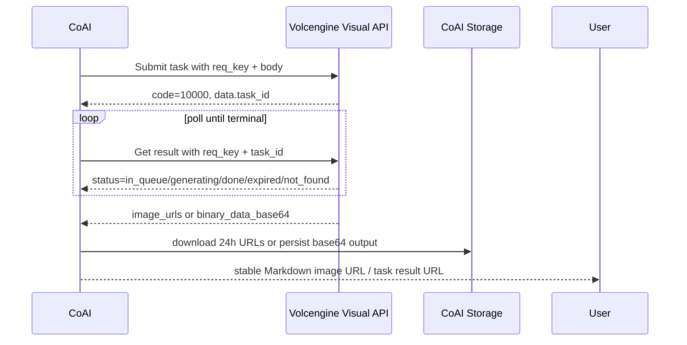

# 即梦 AI 官方 API 文档梳理与 CoAI 集成方案

> 日期：2026-06-22  
> 目标：梳理火山引擎即梦 AI 官方文档，并说明如何在当前 CoAI 项目中通过 API 方式调用极梦/即梦能力，使其既能服务电商图片处理页，也能在对话中作为可配置图片模型使用。

## 1. 结论先行

当前项目里已经有两套“即梦相关”雏形，但都不是火山引擎官方即梦 API：

- `adapter/jimeng`：CLI/subprocess 方式，渠道 secret 被当作 CLI 可执行文件路径。
- `adapter/dreamina`：自定义 Bearer HTTP 服务，接口形态是 `/v1/image2image`、`/v1/image_upscale`、`/v1/query_result`。

火山官方即梦 API 应该走 `https://visual.volcengineapi.com`，使用火山 AK/SK 的 HMAC-SHA256 签名，固定 `Region=cn-north-1`、`Service=cv`，并通过 `Action=CVSync2AsyncSubmitTask` 提交任务、`Action=CVSync2AsyncGetResult` 查询结果。

因此建议新增一个明确的官方渠道类型，例如：

```go
JimengAPIChannelType = "jimeng-api"
```

不要直接复用当前 `jimeng` 或 `dreamina`，避免把 CLI、自定义代理和火山官方 API 三种凭证/协议混在一起。

## 2. 官方文档索引

### 已重点阅读并用于本方案的文档

| 分类 | 文档 | 用途 |
|---|---|---|
| 总览 | [产品动态](https://www.volcengine.com/docs/85621/2533614?lang=zh) | 获取当前完整文档树和版本列表 |
| 总览 | [产品简介](https://www.volcengine.com/docs/85621/1544716?lang=zh) | 明确即梦 AI 产品定位 |
| 计费 | [即梦AI-图像生成计费说明](https://www.volcengine.com/docs/85621/1544714?lang=zh) | 计费模型、免费/付费并发、价格 |
| 接入 | [快速入门](https://www.volcengine.com/docs/85621/1995636?lang=zh) | 开通能力、获取 AK/SK、SDK 入口 |
| 鉴权 | [公共参数](https://www.volcengine.com/docs/6369/67268?lang=zh) | 请求公共参数与 Authorization 格式 |
| 鉴权 | [签名方法](https://www.volcengine.com/docs/6369/67269?lang=zh) | V4 HMAC-SHA256 签名算法 |
| SDK | [AI中台 SDK 使用说明](https://www.volcengine.com/docs/6444/1340578?lang=zh) | SDK 调用形态 |
| HTTP | [HTTP 请求示例](https://www.volcengine.com/docs/6444/1390583?lang=zh) | 直接 HTTP 签名调用参考 |
| 图片生成 4.6 | [产品介绍](https://www.volcengine.com/docs/85621/2288388?lang=zh) / [接口文档](https://www.volcengine.com/docs/85621/2275082?lang=zh) | 推荐新接入的通用图片生成/编辑模型 |
| 图片生成 4.0 | [产品介绍](https://www.volcengine.com/docs/85621/1820192?lang=zh) / [接口文档](https://www.volcengine.com/docs/85621/1817045?lang=zh) | 用户给定入口，作为兼容模型 |
| 素材提取 POD | [产品文档](https://www.volcengine.com/docs/85621/1927051?lang=zh) / [接口文档](https://www.volcengine.com/docs/85621/1925087?lang=zh) | 电商图案/包装/logo/纹理提取 |
| 商品提取 | [产品文档](https://www.volcengine.com/docs/85621/2134550?lang=zh) / [接口文档](https://www.volcengine.com/docs/85621/2129114?lang=zh) | 服装、鞋包、饰品、家具、日用品等主体提取 |
| Inpainting | [产品文档](https://www.volcengine.com/docs/85621/2136166?lang=zh) / [接口文档](https://www.volcengine.com/docs/85621/1976207?lang=zh) | 局部重绘、消除笔 |
| 智能超清 | [产品介绍](https://www.volcengine.com/docs/85621/2164805?lang=zh) / [接口文档](https://www.volcengine.com/docs/85621/2164806?lang=zh) | 4K/8K 超清 |
| 文生图 3.0 | [产品介绍](https://www.volcengine.com/docs/85621/1770795?lang=zh) / [接口文档](https://www.volcengine.com/docs/85621/1616429?lang=zh) | 旧版文生图兼容 |
| 文生图 3.1 | [产品介绍](https://www.volcengine.com/docs/85621/1770977?lang=zh) / [接口文档](https://www.volcengine.com/docs/85621/1756900?lang=zh) | 旧版文生图兼容 |
| 图生图 3.0 | [产品介绍](https://www.volcengine.com/docs/85621/1749156?lang=zh) / [接口文档](https://www.volcengine.com/docs/85621/1747301?lang=zh) | 旧版图片编辑兼容 |
| Outpainting | [接口文档](https://www.volcengine.com/docs/85621/2375477?lang=zh) | 智能扩图 |

### 已索引、暂不作为本次图片 API 接入主线的文档

这些文档属于视频生成、动作模仿、数字人或小云雀 Agent，后续如果做视频工作流可以单独展开：

- [即梦AI-视频生成计费说明](https://www.volcengine.com/docs/85621/1544715?lang=zh)
- [视频生成 3.0 Pro 产品介绍](https://www.volcengine.com/docs/85621/1783678?lang=zh) / [接口文档](https://www.volcengine.com/docs/85621/1777001?lang=zh)
- [视频生成 3.0 产品介绍](https://www.volcengine.com/docs/85621/1792707?lang=zh) / [720P 接口](https://www.volcengine.com/docs/85621/1792710?lang=zh) / [1080P 接口](https://www.volcengine.com/docs/85621/1792711?lang=zh)
- [动作模仿产品介绍](https://www.volcengine.com/docs/85621/1798365?lang=zh) / [接口文档](https://www.volcengine.com/docs/85621/1798351?lang=zh)
- OmniHuman1.5：[产品介绍](https://www.volcengine.com/docs/85621/1834143?lang=zh)、[主体识别](https://www.volcengine.com/docs/85621/1828975?lang=zh)、[主体检测](https://www.volcengine.com/docs/85621/1829011?lang=zh)、[视频生成](https://www.volcengine.com/docs/85621/1829013?lang=zh)
- [视频翻译 2.0 产品介绍](https://www.volcengine.com/docs/85621/2235030?lang=zh) / [接口文档](https://www.volcengine.com/docs/85621/2189006?lang=zh)
- [动作模仿 2.0 产品介绍](https://www.volcengine.com/docs/85621/2205633?lang=zh) / [接口文档](https://www.volcengine.com/docs/85621/2201579?lang=zh)
- 小云雀 Agent 系列：智能生视频 Agent 1.0/2.0、营销成片 Agent、短剧漫剧 Agent 及其剧本解析/图片生成/视频生成/视频合成接口。

## 3. 官方 API 通用调用模型

### 3.1 基础请求

所有重点图片能力都共享以下基础形态：

| 项 | 值 |
|---|---|
| Endpoint | `https://visual.volcengineapi.com` |
| Method | `POST` |
| Content-Type | `application/json` |
| Region | `cn-north-1` |
| Service | `cv` |
| Submit Action | `CVSync2AsyncSubmitTask` |
| Get Result Action | `CVSync2AsyncGetResult` |
| Version | `2022-08-31` |

提交任务：

```http
POST /?Action=CVSync2AsyncSubmitTask&Version=2022-08-31
Host: visual.volcengineapi.com
Content-Type: application/json
X-Date: <UTC yyyyMMdd'T'HHmmss'Z'>
X-Content-Sha256: <sha256(body)>
Authorization: HMAC-SHA256 Credential=<AK>/<date>/cn-north-1/cv/request, SignedHeaders=content-type;host;x-content-sha256;x-date, Signature=<signature>
```

查询任务：

```http
POST /?Action=CVSync2AsyncGetResult&Version=2022-08-31
Host: visual.volcengineapi.com
Content-Type: application/json
...
```

### 3.2 任务生命周期



状态含义：

| status | 含义 | CoAI 处理建议 |
|---|---|---|
| `in_queue` | 任务已提交，还未消费 | 继续轮询 |
| `generating` | 任务处理中 | 继续轮询，前端显示进度 |
| `done` | 任务结束 | 看外层 `code/message` 判断成功或失败 |
| `not_found` | 任务不存在或已过期 | 标记失败，不重试同 task_id |
| `expired` | 任务过期 | 允许用户重新提交 |

官方文档说明任务可能 12 小时后过期，返回的 `image_urls` 通常只有 24 小时有效。因此项目必须把结果转存到本地 `storage/results` 或对象存储，不能长期保存火山临时 URL。

### 3.3 错误码与重试

常见业务错误：

| HTTP | code | message | 建议 |
|---|---:|---|---|
| 200 | 10000 | Success | 成功 |
| 400 | 50411 | Pre Img Risk Not Pass | 输入图前审核失败，不重试 |
| 400 | 50412 | Text Risk Not Pass | 输入文本前审核失败，不重试 |
| 400 | 50413 | Post Text Risk Not Pass | 文本敏感词/版权词等，不重试 |
| 400 | 50511 | Post Img Risk Not Pass | 输出图后审核失败，可重试一次或换 seed |
| 400 | 50518 | Pre Img Risk Not Pass: Copyright | 输入版权图失败，不重试 |
| 400 | 50519 | Post Img Risk Not Pass: Copyright | 输出版权图失败，可重试一次 |
| 429 | 50429 | API QPS 超限 | 指数退避重试 |
| 429 | 50430 | 并发超限 | 排队/延迟重试 |
| 500 | 50500 / 50501 | 内部错误 | 不建议盲目重试；记录 request_id |

CoAI 中建议保留 `request_id`、`task_id`、`code`、`message` 到任务表或日志中，方便售后排查。

## 4. 图片能力矩阵

| 建议模型名 | 官方能力 | req_key | 输入 | 关键参数 | 输出 | 适合场景 |
|---|---|---|---|---|---|---|
| `jimeng-seedream-4.6` | 图片生成 4.6 | `jimeng_seedream46_cvtob` | 0-14 张图片 + prompt | `size` / `width,height` / `scale:1-100` / `force_single` / `min_ratio,max_ratio` | PNG URL/base64，多图 | 新接入默认；人像写真、平面设计、风格化、对话生图 |
| `jimeng-seedream-4.0` | 图片生成 4.0 | `jimeng_t2i_v40` | 0-10 张图片 + prompt | `size` / `width,height` / `scale:0-1` / `force_single` / `min_ratio,max_ratio` | PNG URL/base64，多图 | 兼容用户给定文档入口 |
| `jimeng-t2i-3.1` | 文生图 3.1 | `jimeng_t2i_v31` | prompt | `use_pre_llm` / `seed` / `width,height` | JPEG URL/base64，单图 | 旧版文生图兼容 |
| `jimeng-t2i-3.0` | 文生图 3.0 | `jimeng_t2i_v30` | prompt | `use_pre_llm` / `seed` / `width,height` | JPEG URL/base64，单图 | 旧版文生图兼容 |
| `jimeng-i2i-3.0` | 图生图 3.0 智能参考 | `jimeng_i2i_v30` | 1 张图 + prompt | `scale:0-1` / `seed` / `width,height` | JPEG URL/base64 | 旧版图像编辑 |
| `jimeng-inpaint` | 交互编辑 inpainting | `jimeng_image2image_dream_inpaint` | 原图 + mask | `prompt` / `seed` | JPEG URL/base64 | 局部重绘、消除笔 |
| `jimeng-superres` | 智能超清 | `jimeng_i2i_seed3_tilesr_cvtob` | 1 张图 | `resolution:4k/8k` / `scale:0-100` | PNG URL/base64 | 4K/8K 超清 |
| `jimeng-outpaint` | 智能扩图 | `jimeng_img2img_seed3_painting_edit` | 1 张图，或画布+mask | `top,bottom,left,right` / `prompt` / `seed` | PNG URL/base64 | 扩图、改比例、补画布 |
| `jimeng-material-extract` | 素材提取 POD | `i2i_material_extraction` | 1 张图 | `image_edit_prompt` / `width,height` / `lora_weight` / `seed` | JPEG URL/base64 | 图案、包装、logo、纹理提取 |
| `jimeng-product-extract` | 商品提取 | `jimeng_i2i_extract_tiled_images` | 1 张图 | `edit_prompt` / `width,height` / `seed` | JPEG URL/base64 | 服装、鞋包、饰品、家具、日用品主体提取 |

注意：商品提取接口文档的参数表写的是 `edit_prompt`，示例里出现过 `image_edit_prompt`。实现时建议兼容两者，优先按表字段 `edit_prompt`，若真实接口不接受再切换或双写。

## 5. 4.6 与 4.0 的关键差异

| 项 | 4.6 | 4.0 |
|---|---|---|
| req_key | `jimeng_seedream46_cvtob` | `jimeng_t2i_v40` |
| 输入图数量 | 0-14 张 | 0-10 张 |
| 总输出上限 | 最大 `15 - 输入图数量`，建议输出不超过 6 张 | 最大 `15 - 输入图数量` |
| scale 类型 | int，默认 50，范围 `[1,100]` | float，默认 0.5，范围 `[0,1]` |
| 强制单图 | `force_single` | `force_single` |
| 输出尺寸 | 1K-4K 面积；支持智能比例或显式宽高 | 1K-4K 面积；支持智能比例或显式宽高 |
| 当前建议 | 新接入默认 | 兼容保留 |

这个 `scale` 差异很容易踩坑，不能把 4.0 和 4.6 共用同一个裸字段直接透传。

## 6. 当前 CoAI 项目现状

### 6.1 已有相关文件

| 路径 | 当前作用 |
|---|---|
| `adapter/jimeng/` | CLI/subprocess 即梦适配器，不是官方 API |
| `adapter/dreamina/` | 自定义 Bearer HTTP 图片处理适配器，不是官方火山 AK/SK |
| `adapter/common/interface.go` | 已扩展图片编辑、超清、扩图、图生视频接口 |
| `adapter/common/types.go` | 已有 `ImageEditProps`、`ImageUpscaleProps`、`ImageOutpaintProps`、`ImageToVideoProps` |
| `adapter/adapter.go` | 已把 `dreamina` / `jimeng` 注册到 `imageProcessorFactories` |
| `channel/worker.go` | 已有图片处理类渠道调度函数 |
| `addition/photo/` | 电商图片处理模块：上传、任务、提示词、本地处理、AI 调度 |
| `app/src/routes/Photo.tsx` | 图片处理页面 |
| `app/src/components/photo/` | 图片处理前端组件 |
| `manager/images.go` | OpenAI 风格 `/v1/images/generations`，但当前走普通 chat factory |
| `manager/chat.go` | WebSocket 对话，当前只对 video model 做特殊分支 |
| `docs/photo-migration-plan.md` | 已有 photo2 → CoAI 迁移规划 |

### 6.2 当前配置状态

当前 `config/config.yaml` 里已经有启用的 `jimeng` 渠道：

```yaml
type: jimeng
name: 即梦CLI
models:
  - jimeng-v2
  - jimeng-video
```

这条渠道应继续视为 CLI 集成。官方 API 不建议复用它。

根目录 `config.yaml` 里还出现过一个关闭状态的 `dreamina` 渠道：

```yaml
type: dreamina
name: 即梦API
models:
  - dreamina-v2
  - dreamina-video
state: false
```

但当前 `adapter/dreamina` 代码需要的是 Bearer token + 自定义 endpoint，也不是火山官方 API。

### 6.3 主要缺口

1. 缺少官方 Volcengine Visual API 客户端，包括 AK/SK 签名、submit、poll、callback 解析。
2. 当前图片处理接口的 props 太薄，缺少 `req_key`、尺寸、seed、force_single、scale 差异、mask、返回 URL/base64、任务元数据等参数。
3. `/v1/images/generations` 当前把 prompt 当成 chat 请求，没有走图片处理 factory。
4. WebSocket 对话中选择 Jimeng 模型时，目前不会自动走图片生成/编辑分支。
5. 火山返回的 24 小时 URL 还没有被统一转存为 CoAI 稳定 URL。

## 7. 推荐目标架构

### 7.1 新增官方 API 适配器

建议新增目录：

```
adapter/jimengapi/
  client.go       # V4 签名、submit、getResult、poll
  types.go        # 官方请求/响应类型
  image.go        # 图片生成/编辑统一实现
  upscale.go      # 智能超清
  outpaint.go     # 扩图
  extract.go      # 素材/商品提取
  struct.go       # 从 ChannelConfig 初始化
```

新增渠道类型：

```go
const JimengAPIChannelType = "jimeng-api"
```

注册位置：

- `globals/constant.go`
- `adapter/adapter.go`
- `app/src/admin/channel.ts`
- 如需默认模型提示，补 `app/src/admin/market.ts` / 模型市场配置

### 7.2 官方 API Channel 配置建议

沿用当前 `Channel.Secret` 的多行密钥池机制，每行一组 AK/SK：

```yaml
channel:
  - id: 20
    name: "火山即梦官方 API"
    type: "jimeng-api"
    models:
      - "jimeng-seedream-4.6"
      - "jimeng-seedream-4.0"
      - "jimeng-inpaint"
      - "jimeng-superres"
      - "jimeng-outpaint"
      - "jimeng-material-extract"
      - "jimeng-product-extract"
    endpoint: "https://visual.volcengineapi.com"
    secret: "AKxxx|SKxxx"
    priority: 1
    weight: 1
    retry: 1
    state: true
    group:
      - normal
      - basic
      - standard
      - pro
```

实现中使用：

```go
aksk := channel.SplitRandomSecret(2)
ak := aksk[0]
sk := aksk[1]
```

如果以后需要更清晰的字段，可以再扩展 `ChannelConfig`，但第一阶段不建议大改配置结构。

### 7.3 模型到 req_key 的映射

建议在 `adapter/jimengapi` 内维护注册表：

```go
type Capability string

const (
    CapGenerate Capability = "generate"
    CapInpaint  Capability = "inpaint"
    CapUpscale  Capability = "upscale"
    CapOutpaint Capability = "outpaint"
    CapExtract  Capability = "extract"
)

type ModelSpec struct {
    Model        string
    ReqKey       string
    Capability   Capability
    MaxImages    int
    ScaleKind    string // "float_0_1" or "int_1_100"
    DefaultScale any
    OutputFormat string
}
```

这比在业务代码里到处写 `switch model` 更稳，后续加 4.7 或新能力时只改注册表。

### 7.4 统一图片生成接口

当前已有 `ImageEditFactory` 等接口，但缺一个“文生图/通用生图”接口。建议新增：

```go
type ImageGenerationFactory interface {
    CreateImageGenerationRequest(props *ImageGenerationProps, hook globals.Hook) error
}

type ImageGenerationProps struct {
    RequestProps
    Model         string
    OriginalModel string
    Prompt        string
    Images        []string
    N             int
    Width         *int
    Height        *int
    Size          *int
    ForceSingle   *bool
    Seed          *int
    Scale         *float64
    ReturnURL     bool
    User          string
}
```

然后让：

- `/v1/images/generations`
- WebSocket 对话中的图片模型分支
- Photo 页面中的通用图片编辑能力

都调用同一个 channel 调度入口，例如：

```go
channel.NewImageGenerationRequestWithChannel(...)
```

### 7.5 对话中使用 Jimeng

不要把 Jimeng 当文字聊天模型。建议规则是：

1. 用户在模型选择器里选择 `jimeng-seedream-4.6` 等图片模型。
2. `manager/chat.go` 在 `createChatTask` 中判断图片模型，类似现在的 video model 分支。
3. 若是图片模型：
   - 从最后一条用户消息取 prompt。
   - 若消息里有图片 URL 或上传图片，则转成可供官方 API 使用的 URL/base64。
   - 调用 `NewImageGenerationRequestWithChannel`。
   - 轮询期间向前端推送“已提交 / 生成中 / 下载结果 / 完成”等文本进度。
   - 完成后返回 Markdown 图片，例如 ``。
4. 保存 conversation 时保存稳定 URL，而不是火山 24 小时临时 URL。

建议新增：

```go
var ImageGenerationModels = []string{
    "jimeng-seedream-4.6",
    "jimeng-seedream-4.0",
    "jimeng-t2i-3.1",
    "jimeng-t2i-3.0",
}

func IsImageGenerationModel(model string) bool { ... }
```

### 7.6 OpenAI 兼容 `/v1/images/generations`

当前 `manager/images.go` 用 chat 请求生成图片，这对 DALL·E 类聊天适配器可用，但对官方 Jimeng 不合适。建议改成：

- 如果模型命中 `ImageGenerationFactory`，走图片 factory。
- 否则保留现有 chat-buffer 提取 Markdown 图片的兼容逻辑。

这样不会破坏已有 OpenAI/DALL·E 行为，又能让 Jimeng 作为 OpenAI-compatible 图片生成接口使用。

### 7.7 Photo 页面图片处理

当前 `addition/photo/processor.go` 已经通过这些函数进入 channel：

- `NewImageEditRequestWithChannel`
- `NewImageUpscaleRequestWithChannel`
- `NewImageOutpaintRequestWithChannel`
- `NewImageToVideoRequestWithChannel`

官方 Jimeng API 接入后，Photo 页功能可以这样映射：

| Photo 功能 | 推荐官方能力 |
|---|---|
| 白底图 / 场景图 / 换色 / 营销图 / 模特图 / 材质修改 / 指令生成 | `jimeng-seedream-4.6` 或 `jimeng-seedream-4.0` |
| 擦除 / 局部改图 | `jimeng-inpaint`，但前端必须能生成 mask |
| 高清放大 | `jimeng-superres` |
| 改尺寸 / 扩画布 | `jimeng-outpaint` |
| 图案/logo/纹理提取 | `jimeng-material-extract` |
| 商品主体提取 | `jimeng-product-extract` |
| 细节图 / logo 合成 | 继续本地处理 |

## 8. 数据与存储建议

建议在任务记录里保存以下信息：

| 字段 | 用途 |
|---|---|
| `provider` | `jimeng-api` |
| `model` | CoAI 模型名 |
| `req_key` | 官方服务标识 |
| `task_id` | 火山任务 ID |
| `request_id` | 火山 request_id |
| `status` | CoAI 状态 |
| `provider_status` | 火山原始状态 |
| `provider_code` | 火山 code |
| `provider_message` | 火山 message |
| `result_urls` | CoAI 稳定结果 URL |
| `raw_result` | 可选，排障时使用 |

如果先不改表结构，至少应把 `task_id/request_id/code/message` 写入日志，并把结果下载到 `storage/results`。

## 9. 计费与并发策略

官方计费页当前说明：

- 4.0 / 4.6 / POD / 商品提取：按成功生成图片张数计费，当前表价 0.22 元/图。
- Inpainting：按成功调用计费，当前表价 0.20 元/次。
- 智能超清：按成功调用计费，当前表价 0.40 元/次。
- 免费状态：体验额度 200 次，并发限制 1。
- 付费状态：默认并发通常为 1 或 2，以控制台为准。
- 只有成功返回生成图片才计费；控制台价格最终为准。

CoAI 内部建议：

1. 互动对话默认 `force_single=true`，避免一次 prompt 生成多图导致费用不可控。
2. Photo 批处理要限制并发，默认不超过渠道并发 1；如果购买了并发包，再通过配置放开。
3. 429 / 并发超限应进入队列或延迟重试，不要高频轮询。
4. 对多图输出按实际保存结果数记录用量。

## 10. 分阶段实施计划

### Phase 1：官方客户端与签名

- 新增 `adapter/jimengapi/client.go`。
- 实现：
  - `Sign(req)`
  - `Submit(reqKey, body)`
  - `GetResult(reqKey, taskID, reqJSON)`
  - `Poll(taskID)`
- 单测签名 canonical request、query 排序、body hash、header 组成。

### Phase 2：模型/能力注册表

- 新增模型到 `req_key` 的注册表。
- 处理 4.6 / 4.0 的 `scale` 差异。
- 统一输入校验：图片数量、大小、尺寸、mask 数量、prompt 长度、宽高范围。

### Phase 3：Photo 页面接入

- 先接入：
  - `jimeng-seedream-4.6`
  - `jimeng-superres`
  - `jimeng-outpaint`
- 再接入：
  - `jimeng-inpaint`
  - `jimeng-material-extract`
  - `jimeng-product-extract`
- 所有结果转存 `storage/results`。

### Phase 4：对话与 `/v1/images/generations`

- 新增 `IsImageGenerationModel`。
- 在 `manager/chat.go` 增加图片模型分支。
- 改造 `manager/images.go`：Jimeng API 模型走图片 factory，其他模型保留原逻辑。
- 前端模型市场给 Jimeng 图片模型添加 `image-generation` tag。

### Phase 5：后台配置与文档

- `app/src/admin/channel.ts` 新增 `jimeng-api` 类型说明。
- 明确 secret 格式为 `AK|SK`，支持多行密钥池。
- 示例模型默认填入官方模型名。
- 补充管理员配置说明。

### Phase 6：验证

至少覆盖：

- 签名单测。
- 无 AK/SK / 错误 AK/SK。
- 未开通服务。
- QPS/并发超限。
- prompt 风控。
- 图片 URL 过期前转存。
- 4.6 文生图。
- 4.6 图像编辑。
- 超清。
- 扩图。
- `/v1/images/generations`。
- WebSocket 对话选择 Jimeng 图片模型。

## 11. 需要特别小心的坑

1. **不要把 AK/SK 暴露给前端。** 所有签名都必须在 Go 后端完成。
2. **不要长期保存火山临时 URL。** 官方 `image_urls` 通常 24 小时有效，必须转存。
3. **4.6 和 4.0 的 scale 类型不同。** 4.6 是 int 1-100，4.0 是 float 0-1。
4. **商品提取文档字段存在不一致。** `edit_prompt` 与示例里的 `image_edit_prompt` 需要实测确认。
5. **Inpainting 需要 mask。** 当前普通上传图不能直接满足，需要前端涂抹/选区或后端生成 mask。
6. **对话中使用 Jimeng 不等于普通聊天。** 它应作为图片生成模型分支，返回图片 Markdown 和进度文本。
7. **官方并发低。** 默认并发 1/2 时，Photo 批处理必须排队。

## 12. 推荐下一步

如果后续开始编码，我建议按这个顺序来：

1. 新增 `jimeng-api` 渠道类型与官方 Visual API client。
2. 先打通 `jimeng-seedream-4.6` 单图文生图，结果转存到 `storage/results`。
3. 接入 `/v1/images/generations`。
4. 再接入 WebSocket 对话图片模型。
5. 最后回到 Photo 页面，把编辑、超清、扩图、提取等能力逐个映射。

这样最小闭环最清楚：先证明官方 API 能从 CoAI 配置里调用，再逐步替换现有 CLI/自定义代理逻辑。
